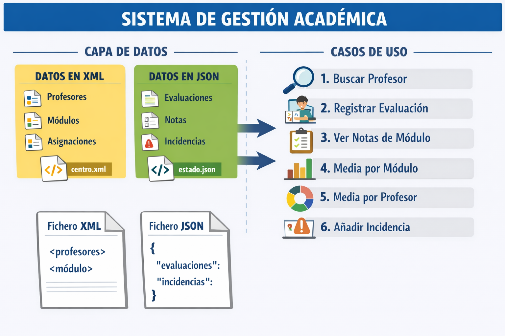

# Centro híbrido XML + JSON 



Proyecto Java para trabajar de forma conjunta con **ficheros XML y JSON** mediante una arquitectura por capas.

## Objetivo

La aplicación simula un sistema académico sencillo donde:

- **XML** contiene la información estructural y relativamente estable del centro:
  - profesores
  - módulos
  - relación entre profesor y módulo

- **JSON** contiene la información dinámica del sistema:
  - evaluaciones
  - incidencias

La aplicación dispone de un **menú interactivo por consola** para demostrar el funcionamiento real de todas las operaciones de la capa de servicio.

---

## Casos de uso

### 1. Buscar profesor
Permite recuperar un profesor por su identificador.

**Ejemplo**
- Entrada: `P01`
- Salida esperada: Ana Pérez, departamento Informática

---

### 2. Buscar módulo
Permite recuperar un módulo por su identificador.

**Ejemplo**
- Entrada: `M02`
- Salida esperada: Acceso a Datos, asociado al profesor `P01`

---

### 3. Listar módulos de un profesor
Devuelve todos los módulos impartidos por un profesor.

**Ejemplo**
- Entrada: `P01`
- Salida esperada:
  - Programación
  - Acceso a Datos

---

### 4. Registrar evaluación
Permite registrar una nueva nota de un alumno en un módulo.

**Ejemplo**
- Entrada:
  - Alumno: `Sofía`
  - Módulo: `M01`
  - Nota: `9.25`

- Efecto:
  - Se añade una evaluación al fichero `estado.json`

---

### 5. Listar evaluaciones de un módulo
Muestra todas las evaluaciones asociadas a un módulo.

**Ejemplo**
- Entrada: `M01`
- Salida esperada:
  - Pedro → 8.5
  - Laura → 6.5

---

### 6. Calcular media de un módulo
Calcula la media de las notas de un módulo.

**Ejemplo**
- Entrada: `M01`
- Resultado esperado:
  - `(8.5 + 6.5) / 2 = 7.5`

---

### 7. Calcular media de un profesor
Calcula la media global de todos los módulos impartidos por un profesor.

**Ejemplo**
- Entrada: `P01`
- Módulos del profesor:
  - M01
  - M02
- Evaluaciones:
  - 8.5, 6.5, 9.0
- Resultado esperado:
  - `8.0`

---

### 8. Registrar incidencia
Permite registrar una incidencia asociada a un profesor.

**Ejemplo**
- Entrada:
  - Profesor: `P03`
  - Descripción: `Fallo de red`
  - Fecha: `2026-04-20`

- Efecto:
  - Se añade una incidencia al fichero `estado.json`

---

### 9. Listar incidencias de un profesor
Muestra las incidencias asociadas a un profesor.

**Ejemplo**
- Entrada: `P01`
- Salida esperada:
  - Falta cable HDMI en el aula A1
  - Incidencia con el proyector

---

### 10. Mostrar rutas de los ficheros
Muestra la ubicación real de los ficheros XML y JSON usados por la aplicación.

---

## Datos precargados

El proyecto incluye datos reales de ejemplo para que todas las funcionalidades devuelvan resultados desde el primer arranque.

### Profesores precargados
- `P01` → Ana Pérez → Informática
- `P02` → Luis Martín → FOL
- `P03` → Marta Suárez → Bases de Datos

### Módulos precargados
- `M01` → Programación → `P01`
- `M02` → Acceso a Datos → `P01`
- `M03` → Formación y Orientación Laboral → `P02`
- `M04` → Bases de Datos → `P03`

### Evaluaciones precargadas
- Pedro → M01 → 8.5
- Laura → M01 → 6.5
- Mario → M02 → 9.0
- Lucía → M03 → 7.5
- Nora → M04 → 8.0
- Iván → M04 → 5.5

### Incidencias precargadas
- P01 → Falta cable HDMI en el aula A1 → 2026-04-10
- P01 → Incidencia con el proyector → 2026-04-11
- P02 → Aula cerrada al inicio de la sesión → 2026-04-12
- P03 → Equipos sin conexión a la base de datos → 2026-04-13

---

## Estructura del proyecto

```text
src/
  main/
    java/
      com/ejemplo/centro/
        Main.java
        model/
          Profesor.java
          Modulo.java
          CentroData.java
          Evaluacion.java
          Incidencia.java
          EstadoCentro.java
        repository/
          CentroXmlRepository.java
          CentroXmlRepositoryImpl.java
          EstadoJsonRepository.java
          EstadoJsonRepositoryImpl.java
        service/
          CentroService.java
          CentroServiceImpl.java
        util/
          XmlManager.java
          JsonManager.java
data/
  centro.xml
  estado.json
pom.xml
README.md
```

---

## Estructura de los ficheros

### XML: `data/centro.xml`

```xml
<centro>
  <profesores>
    <profesor id="P01">
      <nombre>Ana Pérez</nombre>
      <departamento>Informática</departamento>
    </profesor>
  </profesores>
  <modulos>
    <modulo id="M01">
      <nombre>Programación</nombre>
      <profesorId>P01</profesorId>
    </modulo>
  </modulos>
</centro>
```

### JSON: `data/estado.json`

```json
{
  "evaluaciones": [
    {
      "alumno": "Pedro",
      "moduloId": "M01",
      "nota": 8.5
    }
  ],
  "incidencias": [
    {
      "profesorId": "P01",
      "descripcion": "Falta cable HDMI en el aula A1",
      "fecha": "2026-04-10"
    }
  ]
}
```

---

## Ejecución

### Ejecutar tests
```bash
mvn test
```

### Ejecutar el menú interactivo
```bash
mvn exec:java -Dexec.mainClass=com.ejemplo.centro.Main
```

---

## Flujo de trabajo recomendado en la demostración

1. Buscar `P01`
2. Buscar `M01`
3. Listar módulos de `P01`
4. Listar evaluaciones de `M01`
5. Calcular media de `M01`
6. Calcular media de `P01`
7. Listar incidencias de `P01`
8. Registrar una nueva evaluación
9. Registrar una nueva incidencia
10. Volver a listar para comprobar persistencia

---

## Observación

Los ficheros `data/centro.xml` y `data/estado.json` ya vienen incluidos en el proyecto para que todas las funcionalidades se puedan probar manualmente sin necesidad de cargar datos adicionales.


## Batería de tests por capas

El proyecto incluye **40 tests** organizados y ejecutados en este orden:

1. **Repositorio XML** (`A01CentroXmlRepositoryImplTest`) → 8 tests
2. **Repositorio JSON** (`A02EstadoJsonRepositoryImplTest`) → 12 tests
3. **Servicio** (`B01CentroServiceImplTest`) → 20 tests

La ejecución se ordena por:
- nombre de clase (alfabético, configurado en Surefire)
- orden de método (`@Order`) dentro de cada clase

### Reparto de la nota
- Repositorio XML: **1.60 puntos**
- Repositorio JSON: **2.40 puntos**
- Servicio: **6.00 puntos**
- **Total: 10.00 puntos**

## Cálculo automático de la nota

### Uso
```bash
mvn verify -Pcalificar
```

### Resultado
Se genera el archivo:
```text
target/nota.txt
```

Y además se muestra por consola:
- nota final sobre 10
- puntuación por bloque
- ruta del detalle generado
