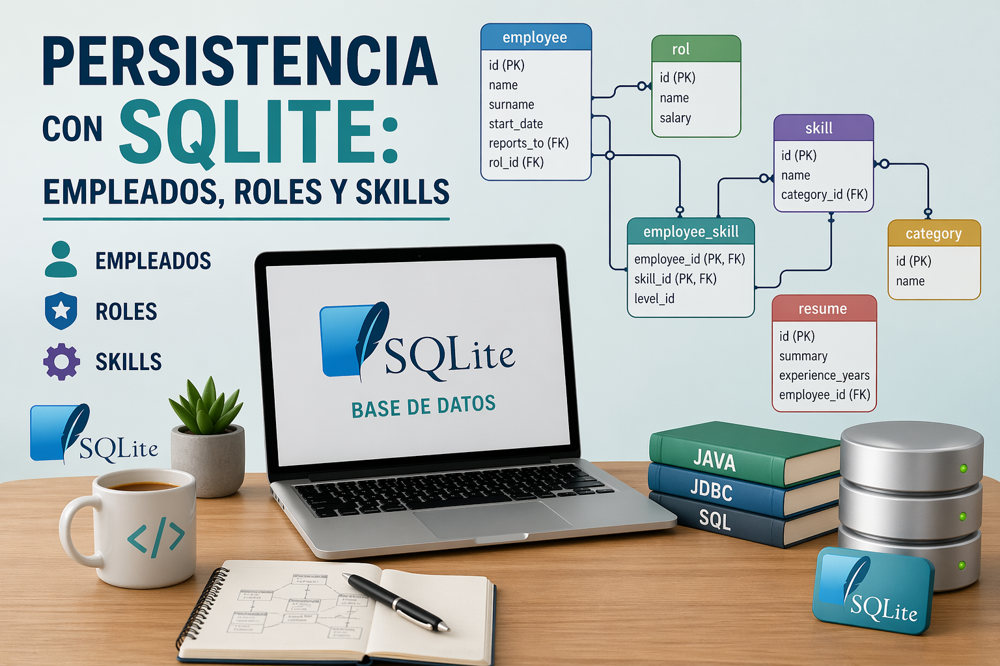

<div style="text-align: justify;">

# Proyecto de persistencia con SQLite: empleados, roles y skills


<div style="text-align: center;">
  
</div>

## Enunciado

Desarrolla una aplicacion Java siguiendo una arquitectura por capas.

La aplicacion debe gestionar **empleados** y **skills** usando una base de datos **SQLite** con tablas auxiliares de roles, categorias y resume.

La idea del ejercicio es que practiques:

- modelado de objetos de dominio
- acceso a datos con `PreparedStatement`
- validaciones en capa `service`
- relaciones entre tablas
- consultas y operaciones derivadas
- tests automatizados con restauracion de base de datos

### Reglas del dominio

- La clave principal de `employee` es `id`.
- Cada empleado pertenece a un unico `rol`.
- Un empleado puede reportar a otro empleado mediante `reports_to`.
- Cada `skill` pertenece a una unica `category`.
- Un empleado puede tener varias skills y una skill puede pertenecer a varios empleados.
- Un `resume` pertenece a un unico empleado.
- Las validaciones principales deben hacerse en la capa `service`.
- El acceso a datos debe hacerse desde la capa `repository`.

---

## 1 Objetivos

Debes ser capaz de:

- organizar un proyecto en paquetes `app`, `model`, `repository` y `service`
- crear clases de modelo con constructores, getters, setters, `equals`, `hashCode` y `toString`
- implementar CRUD sobre SQLite con `PreparedStatement`
- aplicar validaciones de negocio sencillas, es decir, `valida los datos en las entradas`.
- gestionar relaciones entre tablas
- probar el comportamiento de la capa `service` con tests automatizados
- restaurar una base de datos vacia desde copia de seguridad antes de cada test

---

## 2 Modelo de datos

### Tabla `rol`

- `id` INTEGER PRIMARY KEY
- `name` TEXT UNIQUE NOT NULL
- `salary` INTEGER NOT NULL

### Tabla `category`

- `id` INTEGER PRIMARY KEY
- `name` TEXT UNIQUE NOT NULL

### Tabla `employee`

- `id` INTEGER PRIMARY KEY
- `name` TEXT NOT NULL
- `surname` TEXT NOT NULL
- `start_date` TEXT NOT NULL
- `reports_to` INTEGER
- `rol_id` INTEGER NOT NULL

### Tabla `skill`

- `id` INTEGER PRIMARY KEY
- `name` TEXT UNIQUE NOT NULL
- `category_id` INTEGER NOT NULL

### Tabla `resume`

- `id` INTEGER PRIMARY KEY
- `summary` TEXT
- `experience_years` INTEGER NOT NULL
- `employee_id` INTEGER UNIQUE NOT NULL

### Tabla `employee_skill`

- `employee_id` INTEGER NOT NULL
- `skill_id` INTEGER NOT NULL
- `level_id` TEXT
- PRIMARY KEY (`employee_id`, `skill_id`)

---

## 3 Tareas minimas a implementar

### EmployeeService

- crear empleado
- buscar empleado por id
- listar todos los empleados
- actualizar empleado
- eliminar empleado por id
- listar empleados por rol
- listar managers
- cambiar manager de un empleado
- contar subordinados de un manager
- buscar empleados por apellido

### SkillService

- crear skill
- buscar skill por id
- listar todas las skills
- actualizar skill
- eliminar skill por id
- listar skills por categoria
- asignar una skill a un empleado
- listar skills de un empleado
- contar empleados que tienen una skill
- listar skills sin asignar

---

## 4 Reglas de validacion sugeridas

### EmployeeService

- `name` no puede ser nulo ni vacio
- `surname` no puede ser nulo ni vacio
- `startDate` es obligatorio
- no se puede crear un empleado si el rol no existe
- si `reportsTo` no es nulo, el manager debe existir
- un empleado no puede ser manager de si mismo
- no se puede actualizar un empleado que no existe

### SkillService

- `name` no puede ser nulo ni vacio
- no se puede crear una skill con nombre repetido
- no se puede crear una skill si la categoria no existe
- no se puede asignar una skill a un empleado inexistente
- no se puede asignar una skill inexistente
- no se puede duplicar la asignacion `employee_skill`

---

## 5 Construcción de la solución

### Paso 1

Implementa primero el CRUD basico de `EmployeeService` y `SkillService`:

- crear
- buscar por id
- listar
- actualizar
- eliminar

> Consultas `sql` simples que te permiten comentar a trabajar. También puedes entrar dentro de la carpeta `resources/data/sqlite` y acceder a través de `sqlite3 employee.db`, y ejecutar las consultas y operaciones que consideres necesarias.

### Paso 2

Implementa los filtros y consultas derivadas:

- `listarPorRol`
- `listarPorCategoria`
- `buscarPorApellido`
- `listarManagers`
- `listarSinAsignar`

### Paso 3

Implementa la logica relacional:

- `cambiarManager`
- `contarSubordinados`
- `asignarEmpleado`
- `listarPorEmpleado`
- `contarEmpleadosConSkill`

---

## 6 Pistas de implementacion

- Puedes utilizar `findAll()` del repositorio para resolver parte de la logica en `service` durante el incicio y después crear un método dentro de de la interfaz de los repositorios para afinar las búsquedas a través de `sql`. 
- Para los tests, la BBDD siempre empieza vacia y con catalogos base insertados por soporte.
- Antes de crear empleados, comprueba roles y managers.
- Antes de crear skills, comprueba categorias.
- La tabla `employee_skill` exige evitar duplicados por clave primaria compuesta.

---

## 7 Estructura del proyecto

```text
src/main/java/com/ejemplo/
├── app
├── model
├── repository
│   └── sqlite
└── service
```

```text
src/test/java/com/ejemplo/
├── service
└── support
```

---

## 8 Base de datos de test

Los tests restauran antes de cada ejecucion una base de datos vacia desde:

- `src/main/resources/data/sqlite/employee.db`
- `src/main/resources/data/sqlite/employee_backup.db`

Despues insertan por soporte los datos auxiliares minimos para cada prueba.

---

## 9 Pruebas automatizadas

La suite de tests verifica:

- creacion correcta de empleados y skills
- rechazo de datos invalidos
- actualizacion y borrado
- filtros por rol, categoria y manager
- asignacion de skills a empleados
- conteos y listados derivados
- aislamiento entre tests restaurando la BBDD

---

## 10 Calificacion automatica

Para comenzar a trabajar y ver que todo evoluciona como se espera debes de ejecutar:

```bash
mvn clean test
```

y cuando finalices obtendas algo similar a:

```console
[INFO] Tests run: 20, Failures: 0, Errors: 0, Skipped: 0, Time elapsed: 0.530 s -- in com.ejemplo.repository.sqlite.SkillSqliteRepositoryTest
[INFO] Running com.ejemplo.repository.sqlite.EmployeeSqliteRepositoryTest
[INFO] Tests run: 20, Failures: 0, Errors: 0, Skipped: 0, Time elapsed: 0.087 s -- in com.ejemplo.repository.sqlite.EmployeeSqliteRepositoryTest
[INFO] Running com.ejemplo.service.EmployeeServiceRobustnessSqliteTest
[INFO] Tests run: 50, Failures: 0, Errors: 0, Skipped: 0, Time elapsed: 0.221 s -- in com.ejemplo.service.EmployeeServiceRobustnessSqliteTest
[INFO] Running com.ejemplo.service.SkillServiceRobustnessSqliteTest
[INFO] Tests run: 46, Failures: 0, Errors: 0, Skipped: 0, Time elapsed: 0.189 s -- in com.ejemplo.service.SkillServiceRobustnessSqliteTest
[INFO] Running com.ejemplo.service.SkillServiceSqliteTest
[INFO] Tests run: 13, Failures: 0, Errors: 0, Skipped: 0, Time elapsed: 0.057 s -- in com.ejemplo.service.SkillServiceSqliteTest
[INFO] Running com.ejemplo.service.EmployeeServiceSqliteTest
[INFO] Tests run: 15, Failures: 0, Errors: 0, Skipped: 0, Time elapsed: 0.088 s -- in com.ejemplo.service.EmployeeServiceSqliteTest
[INFO] 
[INFO] Results:
[INFO] 
[INFO] Tests run: 164, Failures: 0, Errors: 0, Skipped: 0
```


La nota se calcula a partir de:

- los reportes XML generados por `mvn test`
- la documentacion Javadoc de las interfaces de servicio

### Reparto de pesos

- **Employee = 5 puntos**
  - 4 puntos por tests del bloque `employee`
  - 1 punto por documentacion de `IEmployeeService`
- **Skill = 5 puntos**
  - 4 puntos por tests del bloque `skill`
  - 1 punto por documentacion de `ISkillService`

### Uso

```bash
mvn clean test verify -Pcalificar
```

Inicialmente:

```console
=== CALIFICACION AUTOMATICA POR BLOQUE ===

EMPLOYEE -> tests totales: 85, pasados: 0, fallados: 85
EMPLOYEE -> aportacion tests: 0.00/4.00
EMPLOYEE -> documentacion interfaz: 0.00/1.00
EMPLOYEE -> metodos no documentados correctamente: crear, buscarPorId, listarTodos, actualizar, eliminar, listarPorRol, listarManagers, cambiarManager, contarSubordinados, buscarPorApellido

SKILL -> tests totales: 79, pasados: 0, fallados: 79
SKILL -> aportacion tests: 0.00/4.00
SKILL -> documentacion interfaz: 0.00/1.00
SKILL -> metodos no documentados correctamente: crear, buscarPorId, listarTodas, actualizar, eliminar, listarPorCategoria, asignarEmpleado, listarPorEmpleado, contarEmpleadosConSkill, listarSinAsignar

=== NOTA FINAL ===
Nota final: 0.00/10
```

y al finalizar:

```console
=== CALIFICACION AUTOMATICA POR BLOQUE ===

EMPLOYEE -> tests totales: 85, pasados: 85, fallados: 0
EMPLOYEE -> aportacion tests: 4.00/4.00
EMPLOYEE -> documentacion interfaz: 1.00/1.00
EMPLOYEE -> interfaz completa para este bloque

SKILL -> tests totales: 79, pasados: 79, fallados: 0
SKILL -> aportacion tests: 4.00/4.00
SKILL -> documentacion interfaz: 1.00/1.00
SKILL -> interfaz completa para este bloque
```

---

## 11 Lógica de negocio que debe de cumplir las servicios

### 11.1  EmployeeService

#### crear(Employee employee)
```java
/**
 * Crea un nuevo empleado.
 * Reglas:
 * - No null
 * - id, name, surname, startDate, rolId obligatorios
 * - No duplicado por id
 * - rol debe existir
 * - reportsTo:
 *   - debe existir
 *   - no puede ser él mismo
 * - Normaliza los datos (trim)
 */
```

#### buscarPorId(Integer id)
```java
/**
 * Devuelve empleado por id.
 * - id null → null
 */
```

#### listarTodos()
```java
/**
 * Devuelve todos los empleados.
 */
```

#### actualizar(Employee employee)
```java
/**
 * Actualiza empleado.
 * - Debe existir
 * - Mismas validaciones que crear
 */
```

#### eliminar(Integer id)
```java
/**
 * Elimina empleado.
 * - id null o inexistente → false
 */
```

#### listarPorRol(Integer rolId)
```java
/**
 * Lista empleados por rol.
 * - rolId null → lista vacía
 */
```

#### listarManagers()
```java
/**
 * Lista empleados que son managers.
 */
```

#### cambiarManager(Integer employeeId, Integer managerId)
```java
/**
 * Cambia manager.
 * - No null
 * - No iguales
 * - Ambos deben existir
 */
```

#### contarSubordinados(Integer managerId)
```java
/**
 * Cuenta subordinados.
 * - null → 0
 */
```

#### buscarPorApellido(String surname)
```java
/**
 * Busca por apellido.
 * - Normalización trim + lower
 */
```

---

### 11.2  SkillService

#### crear(Skill skill)
```java
/**
 * Crea skill.
 * - id, name, categoryId obligatorios
 * - No duplicado por id ni nombre
 * - category debe existir
 */
```

#### actualizar(Skill skill)
```java
/**
 * Actualiza skill.
 * - Debe existir
 * - No duplicado por nombre
 */
```

#### eliminar(Integer id)
```java
/**
 * Elimina skill.
 */
```

#### listarPorCategoria(Integer categoryId)
```java
/**
 * Filtra por categoría.
 */
```

#### asignarEmpleado(Integer employeeId, Integer skillId, String levelId)
```java
/**
 * Asigna skill a empleado.
 * - Ambos deben existir
 * - No duplicado
 */
```

#### listarPorEmpleado(Integer employeeId)
```java
/**
 * Lista skills de empleado.
 */
```

#### contarEmpleadosConSkill(Integer skillId)
```java
/**
 * Cuenta empleados con skill.
 */
```

#### listarSinAsignar()
```java
/**
 * Skills no asignadas.
 */
```

---

## 12 Ejemplos de resolición de las funciones del servicio

### 12.1 Ejemplo acceso BD (existeRol)

```java
/**
 * Comprueba existencia de rol.
 * - PreparedStatement evita SQL injection
 * - SELECT 1 optimiza consulta
 */
public boolean existeRol(Integer rolId) {
    String sql = "SELECT 1 FROM rol WHERE id = ?";
    try (Connection connection = SQLiteConnectionManager.openConnection();
         PreparedStatement ps = connection.prepareStatement(sql)) {
        ps.setInt(1, rolId);
        try (ResultSet rs = ps.executeQuery()) {
            return rs.next();
        }
    } catch (SQLException e) {
        throw new RuntimeException("No se pudo comprobar el rol", e);
    }
}
```

### Explicación
- PreparedStatement → seguridad
- try-with-resources → cierre automático
- rs.next() → existencia

---

### 12.2 Obtén los empleados de un determinado Rol

#### Opción inicial, para aprender pero errónea

> **Lista empleados por rol usando filtrado sobre la lista pre-cargada con un findAll**

```java
@Override
public List<Employee> listarPorRol(Integer rolId) {
    if (rolId == null) {
        return new  new ArrayList<>();
    }

    List<Employee> resultado = new ArrayList<>();

    for (Employee employee : repository.findAll()) {
        if (rolId.equals(employee.getRolId())) {
            resultado.add(employee);
        }
    }

    return resultado;
}
```

#### Versión que se debe de implementar en este y el resto de operaciones

Crea la función en el interface del repositorio:

```java
/**
 * Obtiene empleados por rol desde base de datos.
 *
 * @param rolId id del rol
 * @return lista de empleados
 */
List<Employee> findByRolId(Integer rolId);
```

Implementa en el servicio:

```java
public List<Employee> findByRolId(Integer rolId) {
    String sql = "SELECT id, name, surname, start_date, reports_to, rol_id FROM employee WHERE rol_id = ?";

    List<Employee> empleados = new ArrayList<>();

    try (Connection connection = SQLiteConnectionManager.openConnection();
         PreparedStatement ps = connection.prepareStatement(sql)) {

        ps.setInt(1, rolId);

        try (ResultSet rs = ps.executeQuery()) {
            while (rs.next()) {
                empleados.add(new Employee(
                        rs.getInt("id"),
                        rs.getString("name"),
                        rs.getString("surname"),
                        rs.getString("start_date"),
                        rs.getObject("reports_to") != null ? rs.getInt("reports_to") : null,
                        rs.getInt("rol_id")
                ));
            }
        }

    } catch (SQLException e) {
        throw new RuntimeException("Error al buscar empleados por rol", e);
    }

    return empleados;
}
```

> Como resulta evidente debes de tener el constructor adecuado para poder construir el `Employee` 

Invoca desde el servicio:

```java
@Override
public List<Employee> listarPorRol(Integer rolId) {
    if (rolId == null) {
        return List.of();
    }

    return repository.findByRolId(rolId);
}
```


## 13 Buenas prácticas
- Validación `siempre` en service
- Normaliza los datos - Sin espacios que no sean necesarios, etc, cuando sea necesario.
- Acceso en repository
- Evitar duplicados en las consultas siempre que sea posible

</div>