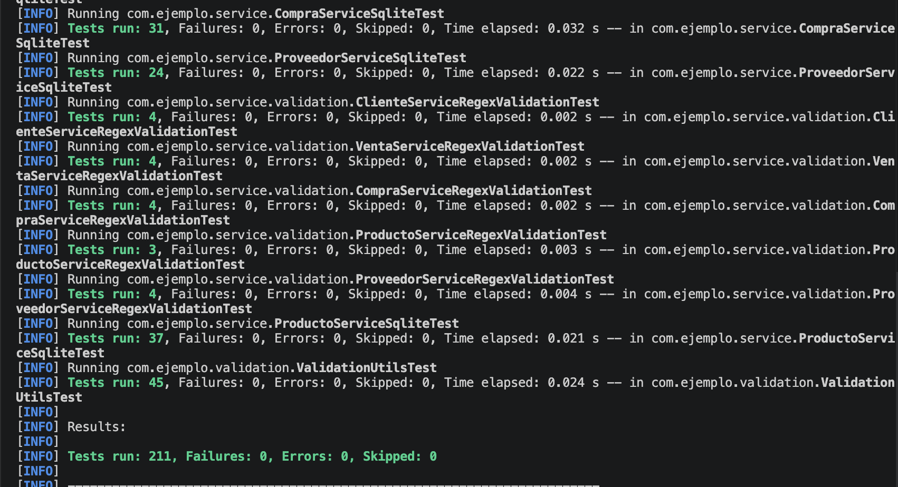

<div align="justify;">

# Ejercicio resuelto: La Frutería de DAM con SQLite, repositorios, servicios

<p align="center">
  
</p>

En este proyecto crearás una aplicación completa para gestionar una frutería, controlando clientes, productos, compras y ventas. Utilizarás tecnologías reales del entorno profesional y aplicarás buenas prácticas de desarrollo (Java 17, Maven, SQLite, patrón repositorio, capa de servicio y tests JUnit 5).

La versión de `bd` usa **claves primarias naturales** en las tablas solicitadas:

- `proveedor.cif` es `PRIMARY KEY`.
- `cliente.dni` es `PRIMARY KEY`.

El resto de tablas principales mantienen clave autoincremental con `INTEGER PRIMARY KEY AUTOINCREMENT`.

---

## 1. Estructura generada

```text
src/main/java/com/ejemplo/model               -> modelos
src/main/java/com/ejemplo/repository          -> interfaces de repositorio
src/main/java/com/ejemplo/repository/sqlite   -> implementación SQLite/JDBC
src/main/java/com/ejemplo/service             -> interfaces y servicios
src/main/resources/data/sqlite                -> schema y base de datos
src/test/java/com/ejemplo/service             -> tests por servicio
src/test/resources/backup.db                  -> copia limpia para cada test
```

<p align="center">
  
</p>

---

## 2. Recuento de capas

| Elemento | Cantidad |
|---|---:|
| Servicios | 5 |
| Interfaces de servicio | 5 |
| Interfaces de repositorio | 5 |
| Repositorios SQLite | 5 |

| Servicio | Interfaz de repositorio | Repositorio SQLite | Tests |
|---|---|---|---:|
| `ClienteService` | `IClienteRepository` | `ClienteSqliteRepository` | 24 |
| `ProveedorService` | `IProveedorRepository` | `ProveedorSqliteRepository` | 24 |
| `ProductoService` | `IProductoRepository` | `ProductoSqliteRepository` | 37 |
| `CompraService` | `ICompraRepository` | `CompraSqliteRepository` | 31 |
| `VentaService` | `IVentaRepository` | `VentaSqliteRepository` | 31 |

---

## 3. Claves primarias de las tablas de bbdd

| Tabla | Clave primaria | Tipo |
|---|---|---|
| `cliente` | `dni` | natural |
| `proveedor` | `cif` | natural |
| `categoria_producto` | `id` | autoincremental |
| `producto` | `id` | autoincremental |
| `compra` | `id` | autoincremental |
| `compra_detalle` | `id` | autoincremental |
| `venta` | `id` | autoincremental |
| `venta_detalle` | `id` | autoincremental |
| `movimiento_stock` | `id` | autoincremental |

> **Importante**: Tener valores autoincremental o no es importante a la hora de realizar las validaciones en las inserciones en las tablas de la bbdd.

### Relaciones modificadas por las claves naturales

Antes, las relaciones con cliente y proveedor podían apuntar a un `id` numérico. En este ejercicio académico se apuntan directamente a la clave natural:

```sql
FOREIGN KEY (cif_proveedor) REFERENCES proveedor(cif)
FOREIGN KEY (cif_proveedor_principal) REFERENCES proveedor(cif)
FOREIGN KEY (dni_cliente) REFERENCES cliente(dni)
```

Esto afecta a las funciones de repositorio y servicio:

- `Cliente`: se usa `findByDni(String dni)` y `deleteByDni(String dni)`.
- `Proveedor`: se usa `findByCif(String cif)` y `deleteByCif(String cif)`.
- `Compra`: se usa `findByProveedor(String cifProveedor)`.
- `Venta`: se usa `findByCliente(String dniCliente)`.

---

## 4. Cómo se resuelve el ejercicio por capas

El orden recomendado es:

```text
1. Crear modelos
2. Realizas las validaciones que necesites en la clase `ValidationUtils`
3. Lanzar los test se han incluido para realizar la validación
4. Crear interfaces de repositorio
5. Implementar repositorios SQLite
6. Crear interfaces de servicio
7. Implementar servicios con validaciones
8. Lanzar los tests de servicio
```

La idea principal es que cada capa tenga una responsabilidad concreta:

| Capa | Responsabilidad |
|---|---|
| Modelo | Representar datos de tablas o vistas |
| Interfaz de repositorio | Declarar las operaciones disponibles |
| Repositorio SQLite | Ejecutar SQL y mapear resultados |
| Interfaz de servicio | Declarar operaciones de negocio |
| Servicio | Validar datos antes de llamar al repositorio |
| Test | Comprobar casos correctos, nulos, vacíos y fallidos |

---

## 5. Modelos

Cada tabla o vista usada por el ejercicio tiene una clase Java simple en `com.ejemplo.model`.

Modelos principales:

- `Cliente`
- `Proveedor`
- `Producto`
- `Compra`
- `Venta`

Modelos auxiliares o de consulta:

- `CategoriaProducto`
- `ProductoCatalogo`
- `MovimientoStock`
- `CompraDetalle`
- `VentaDetalle`
- `VentaResumen`

> Estos modelos son las relaciones entre las tablas

Cada modelo debe tener:

- atributos privados,
- constructor vacío,
- constructor completo,
- getters,
- setters.


Ejemplo:

```java
public class Cliente {
    private String dni;
    private String nombre;
    private String telefono;
    private String email;
    private String ciudad;
    private Integer activo;

    public Cliente() {}

    public Cliente(String dni, String nombre, String telefono, String email, String ciudad, Integer activo) {
        this.dni = dni;
        this.nombre = nombre;
        this.telefono = telefono;
        this.email = email;
        this.ciudad = ciudad;
        this.activo = activo;
    }

    // getters y setters
}
```

> Los modelos se han incluido para que el proyecto compile sin problemas.

---

## 6. Interfaces de repositorio

Las interfaces de repositorio indican qué consultas debe saber hacer cada repositorio, pero no contienen SQL.

Las interfaces que debes de crear son las siguiente:

- `IClienteRepository` 
- `IProveedorRepository` 
- `IProductoRepository` 
- `ICompraRepository` 
- `IVentaRepository` 

> Debes de definir el conjunto de funciones que consideres necesario en cada uno de los repositorios para después realizar la implementación.

Implementaciones de las interfaces de los repositorios en:

- `ClienteSqliteRepository` 
- `ProveedorRepository` 
- `ProductoRepository` 
- `CompraRepository` 
- `VentaRepository` 

---

## 7. Validaciones que deben implementarse y por qué

Las validaciones deben implementarse `siempre` en la **capa de servicio**, `NO` en el repositorio.

El repositorio se encarga de:

- abrir conexión,
- ejecutar SQL,
- mapear `ResultSet`,
- devolver resultados.

El servicio se encarga de:

- comprobar que los datos tienen sentido,
- evitar consultas innecesarias,
- evitar errores de base de datos previsibles,
- devolver una respuesta controlada.

### 7.1. Validaciones generales

| Caso | Validación | Motivo |
|---|---|---|
| Objeto `null` en `create` o `update` | devolver `false` | No se puede insertar ni actualizar un objeto inexistente |
| Texto `null` | devolver `null`, `false` o lista vacía | Evita buscar o guardar claves inválidas |
| Texto vacío o con espacios | usar `trim().isEmpty()` | Un `"   "` no debe considerarse válido |
| `id == null` | devolver `null`, `false` o lista vacía | No se puede buscar una fila sin identificador |
| `id <= 0` | devolver `null`, `false` o lista vacía | Los ids autoincrementales empiezan en 1 |
| Importes negativos | devolver `false` | La base de datos tiene `CHECK` y el negocio no debe aceptar importes negativos |
| Cantidades negativas o cero | devolver `false` | Una línea de compra o venta no puede tener cantidad inválida |
| Estados no permitidos | devolver `false` | La base de datos solo acepta estados concretos |
| Métodos de pago no permitidos | devolver `false` | La tabla `venta` tiene un `CHECK` |
| Activo distinto de 0 o 1 | devolver `false` | La base de datos solo acepta valores booleanos SQLite |

### 7.2. Validaciones para `ClienteService`

`cliente.dni` es clave primaria natural, por tanto debe ser obligatorio.

| Función | Validaciones | Resultado esperado |
|---|---|---|
| `create(cliente)` | cliente no `null`, `dni` no vacío, `nombre` no vacío, `activo` 0 o 1 | `false` si falla |
| `findByDni(dni)` | `dni` no `null` ni vacío | `null` si falla |
| `findAll()` | sin validación previa | lista, puede estar vacía |
| `update(cliente)` | cliente no `null`, `dni` no vacío, `nombre` no vacío, `activo` 0 o 1 | `false` si falla |
| `deleteByDni(dni)` | `dni` no `null` ni vacío | `false` si falla |
| `findActivos()` | sin validación previa | lista, puede estar vacía |
| `findByCiudad(ciudad)` | ciudad no `null` ni vacía | lista vacía si falla |
| `findByEmail(email)` | email no `null` ni vacío | `null` si falla |

> **Motivo**: El `dni` identifica al cliente. Si se permite un DNI vacío, no se puede garantizar la identidad de la fila.

Ejemplo de validación:

```java
private boolean isBlank(String value) {
    return value == null || value.trim().isEmpty();
}

private boolean isValidActivo(Integer activo) {
    return activo != null && (activo == 0 || activo == 1);
}

public Cliente findByDni(String dni) {
    if (isBlank(dni)) {
        return null;
    } 
    return repository.findByDni(dni);
}
```

### 7.3. Validaciones para `ProveedorService`

`proveedor.cif` es clave primaria natural, por tanto debe ser obligatorio.

| Función | Validaciones | Resultado esperado |
|---|---|---|
| `create(proveedor)` | proveedor no `null`, `cif` no vacío, `nombre` no vacío, `activo` 0 o 1 | `false` si falla |
| `findByCif(cif)` | `cif` no `null` ni vacío | `null` si falla |
| `findAll()` | sin validación previa | lista, puede estar vacía |
| `update(proveedor)` | proveedor no `null`, `cif` no vacío, `nombre` no vacío, `activo` 0 o 1 | `false` si falla |
| `deleteByCif(cif)` | `cif` no `null` ni vacío | `false` si falla |
| `findActivos()` | sin validación previa | lista, puede estar vacía |
| `findByCiudad(ciudad)` | ciudad no `null` ni vacía | lista vacía si falla |
| `findByEmail(email)` | email no `null` ni vacío | `null` si falla |

> **Motivo**: el `CIF` no es autoincremental, así que todas las operaciones de búsqueda, actualización y borrado dependen de él.

### 7.4. Validaciones para `ProductoService`

| Función | Validaciones | Resultado esperado |
|---|---|---|
| `create(producto)` | producto no `null`, código no vacío, nombre no vacío, unidad válida, precios válidos, stock válido, categoría válida, activo 0 o 1, perecedero 0 o 1 | `false` si falla |
| `findById(id)` | `id != null && id > 0` | `null` si falla |
| `findAll()` | sin validación previa | lista, puede estar vacía |
| `update(producto)` | producto no `null`, `id > 0` y mismos campos válidos que create | `false` si falla |
| `deleteById(id)` | `id != null && id > 0` | `false` si falla |
| `findActivos()` | sin validación previa | lista, puede estar vacía |
| `findByCategoria(idCategoria)` | `idCategoria != null && idCategoria > 0` | lista vacía si falla |
| `findBajoStock()` | sin validación previa | lista, puede estar vacía |
| `findCatalogo()` | sin validación previa | lista, puede estar vacía |
| `findMovimientosByProducto(idProducto)` | `idProducto != null && idProducto > 0` | lista vacía si falla |

Unidades válidas según la tabla:

```text
kg, unidad, caja, bandeja
```

> **Motivo**:  la tabla `producto` tiene restricciones `CHECK` sobre unidad, precios, stock, activo y perecedero. Validarlo antes evita depender del error SQL.

### 7.5. Validaciones para `CompraService`

| Función | Validaciones | Resultado esperado |
|---|---|---|
| `create(compra)` | compra no `null`, número de factura no vacío, CIF proveedor no vacío, importes >= 0, estado válido | `false` si falla |
| `findById(id)` | `id != null && id > 0` | `null` si falla |
| `findAll()` | sin validación previa | lista, puede estar vacía |
| `update(compra)` | compra no `null`, `id > 0`, factura no vacía, CIF no vacío, importes >= 0, estado válido | `false` si falla |
| `deleteById(id)` | `id != null && id > 0` | `false` si falla |
| `findByProveedor(cifProveedor)` | CIF no `null` ni vacío | lista vacía si falla |
| `findByNumeroFactura(numeroFactura)` | número no `null` ni vacío | `null` si falla |
| `findDetallesByCompra(idCompra)` | `idCompra != null && idCompra > 0` | lista vacía si falla |

Estados válidos:

```text
registrada, cancelada
```

> **Motivo**:  una compra debe estar asociada a un proveedor existente mediante `cif_proveedor`.

### 7.6. Validaciones para `VentaService`

| Función | Validaciones | Resultado esperado |
|---|---|---|
| `create(venta)` | venta no `null`, ticket no vacío, método de pago válido, importes >= 0, estado válido | `false` si falla |
| `findById(id)` | `id != null && id > 0` | `null` si falla |
| `findAll()` | sin validación previa | lista, puede estar vacía |
| `update(venta)` | venta no `null`, `id > 0`, ticket no vacío, método de pago válido, importes >= 0, estado válido | `false` si falla |
| `deleteById(id)` | `id != null && id > 0` | `false` si falla |
| `findByCliente(dniCliente)` | DNI no `null` ni vacío | lista vacía si falla |
| `findByTicket(ticket)` | ticket no `null` ni vacío | `null` si falla |
| `findDetallesByVenta(idVenta)` | `idVenta != null && idVenta > 0` | lista vacía si falla |
| `findResumenVentas()` | sin validación previa | lista, puede estar vacía |

Métodos de pago válidos:

```text
efectivo, tarjeta, bizum, transferencia
```

Estados válidos:

```text
cerrada, anulada
```

> **Motivo**:  la tabla `venta` tiene `CHECK` para método de pago y estado. Además, el ticket es único y obligatorio.

---

## 8. Construcción de sentencias SQL en los repositorios

Las sentencias SQL deben construirse dentro de los repositorios SQLite.

Regla general:

- Para consultas con parámetros se usa `PreparedStatement`.
- Para consultas fijas sin parámetros se puede usar `Statement`.
- **Importante:** `No se deben concatenar valores del usuario dentro del SQL.`

### 8.1. `INSERT`

Ejemplo para cliente:

```java
String sql = "INSERT INTO cliente(dni,nombre,telefono,email,ciudad,activo) VALUES(?,?,?,?,?,?)";

try (Connection cn = SQLiteConnectionManager.getConnection();
     PreparedStatement ps = cn.prepareStatement(sql)) {

    ps.setString(1, cliente.getDni());
    ps.setString(2, cliente.getNombre());
    ps.setString(3, cliente.getTelefono());
    ps.setString(4, cliente.getEmail());
    ps.setString(5, cliente.getCiudad());
    ps.setInt(6, cliente.getActivo());

    return ps.executeUpdate() == 1;
} catch (SQLException e) {
    return false;
}
```

Por qué se usa `PreparedStatement`:

- evita inyección SQL,
- separa la sentencia de los datos,
- permite reutilizar estructura,
- trata correctamente comillas, nulos y tipos.

### 8.2. `SELECT` por clave primaria natural

Ejemplo para proveedor:

```java
String sql = "SELECT * FROM proveedor WHERE cif = ?";

try (Connection cn = SQLiteConnectionManager.getConnection();
     PreparedStatement ps = cn.prepareStatement(sql)) {

    ps.setString(1, cif);

    try (ResultSet rs = ps.executeQuery()) {
        if (rs.next()) {
            return map(rs);
        }
        return null;
    }
} catch (SQLException e) {
    return null;
}
```

### 8.3. `SELECT` de todos los registros

```java
String sql = "SELECT * FROM cliente ORDER BY nombre";
```

En este caso no hay parámetro externo, por lo que se puede usar `Statement`.

### 8.4. `UPDATE`

Ejemplo para proveedor:

```java
String sql = "UPDATE proveedor SET nombre=?, telefono=?, email=?, ciudad=?, activo=? WHERE cif=?";

try (Connection cn = SQLiteConnectionManager.getConnection();
     PreparedStatement ps = cn.prepareStatement(sql)) {

    ps.setString(1, proveedor.getNombre());
    ps.setString(2, proveedor.getTelefono());
    ps.setString(3, proveedor.getEmail());
    ps.setString(4, proveedor.getCiudad());
    ps.setInt(5, proveedor.getActivo());
    ps.setString(6, proveedor.getCif());

    return ps.executeUpdate() == 1;
} catch (SQLException e) {
    return false;
}
```

El `WHERE cif=?` es imprescindible. Sin `WHERE`, se modificarían todos los proveedores.

### 8.5. `DELETE`

Ejemplo para cliente:

```java
String sql = "DELETE FROM cliente WHERE dni = ?";
```

El método debe devolver `true` solo si se elimina una fila:

```java
return ps.executeUpdate() == 1;
```

Si el DNI no existe, `executeUpdate()` devuelve `0`, por tanto el método devuelve `false`.

### 8.6. Consultas con filtros

Ejemplo: productos por categoría.

```java
String sql = "SELECT * FROM producto WHERE id_categoria = ? ORDER BY nombre";
```

Ejemplo: ventas por cliente.

```java
String sql = "SELECT * FROM venta WHERE dni_cliente = ? ORDER BY fecha DESC";
```

Ejemplo: compras por proveedor.

```java
String sql = "SELECT * FROM compra WHERE cif_proveedor = ? ORDER BY fecha DESC";
```

### 8.7. Consultas contra vistas

Ejemplo: catálogo de productos.

```java
String sql = "SELECT * FROM vw_productos_catalogo ORDER BY nombre";
```

Ejemplo: resumen de ventas.

```java
String sql = "SELECT * FROM vw_resumen_ventas ORDER BY fecha DESC";
```

Las vistas se consultan igual que una tabla, `pero no se inserta`, actualizan ni borran directamente.

---

>**Importante**: En el resto de repositorios se realiza de forma similar a la de clientes. Lo ideal es que lances las sentencias sql directamente sobre la `bd` para verificar que es correcta y de esa forma practicas.

---

## 9. Mapeo de resultados SQL a objetos Java

Cada repositorio debe tener un método privado `map(ResultSet rs)`.

Ejemplo para cliente:

```java
    return new Cliente(
        rs.getString("dni"),
        rs.getString("nombre"),
        rs.getString("telefono"),
        rs.getString("email"),
        rs.getString("ciudad"),
        rs.getInt("activo")
    );
```

> Se puede crear un función, como les diria la `IA` pero ustedes están aprendiendo, y si repites el trabajo aprendes, si se lo das a la IA para que lo haga, no sabes lo que estas haciendo.

Motivo:

- repetir código en cada consulta, ayuda a aprender y saber lo que haces
- cuaando estes en segundo aprenderas otras formas más óptimas que la `IA` desconoce

---

## 10. Verificaciones previas directamente en SQLite con `sqlite3`

Antes de programar los repositorios, conviene comprobar que la base de datos funciona y que las consultas devuelven lo esperado.

> **SI NO SABES SQL NO SABES COMO SE IMPLEMENTAN LAS FUNCIONES DENTRO DEL REPOSITORIO**

Desde la raíz del proyecto:

```bash
sqlite3 src/main/resources/data/sqlite/fruteria.db
```

Activar una salida más cómoda:

```sql
.headers on
.mode column
PRAGMA foreign_keys = ON;
```

### 10.1. Ver las tablas existentes

```sql
.tables
```

### 10.2. Ver el esquema completo

```sql
.schema
```

### 10.3. Ver el esquema de una tabla concreta

```sql
.schema cliente
.schema proveedor
.schema producto
.schema compra
.schema venta
```

### 10.4. Comprobar claves primarias naturales

```sql
PRAGMA table_info(cliente);
PRAGMA table_info(proveedor);
```

En `cliente`, la columna `dni` debe aparecer como clave primaria.

En `proveedor`, la columna `cif` debe aparecer como clave primaria.

### 10.5. Comprobar claves foráneas

```sql
PRAGMA foreign_key_list(producto);
PRAGMA foreign_key_list(compra);
PRAGMA foreign_key_list(venta);
```

Resultado esperado:

- `producto.cif_proveedor_principal` referencia `proveedor.cif`.
- `compra.cif_proveedor` referencia `proveedor.cif`.
- `venta.dni_cliente` referencia `cliente.dni`.

### 10.6. Comprobar índices

```sql
PRAGMA index_list(cliente);
PRAGMA index_list(proveedor);
PRAGMA index_list(producto);
```

### 10.7. Comprobar datos iniciales

```sql
SELECT * FROM cliente;
SELECT * FROM proveedor;
SELECT * FROM categoria_producto;
SELECT * FROM producto;
SELECT * FROM compra;
SELECT * FROM venta;
```

### 10.8. Probar búsquedas por clave natural

```sql
SELECT * FROM cliente
WHERE dni = '12345678A';

SELECT * FROM proveedor
WHERE cif = 'B12345678';
```

Si no conoces los valores existentes, primero lista las claves:

```sql
SELECT dni, nombre FROM cliente;
SELECT cif, nombre FROM proveedor;
```

### 10.9. Probar consultas de filtros

Clientes activos:

```sql
SELECT * FROM cliente
WHERE activo = 1
ORDER BY nombre;
```

Proveedores por ciudad:

```sql
SELECT * FROM proveedor
WHERE ciudad = 'Valencia'
ORDER BY nombre;
```

Productos bajo stock:

```sql
SELECT * FROM producto
WHERE stock_actual <= stock_minimo
ORDER BY nombre;
```

Compras de un proveedor:

```sql
SELECT * FROM compra
WHERE cif_proveedor = 'B12345678'
ORDER BY fecha DESC;
```

Ventas de un cliente:

```sql
SELECT * FROM venta
WHERE dni_cliente = '12345678A'
ORDER BY fecha DESC;
```

### 10.10. Probar vistas

```sql
SELECT * FROM vw_productos_catalogo;
SELECT * FROM vw_productos_bajo_stock;
SELECT * FROM vw_resumen_ventas;
```

### 10.11. Comprobar restricciones `CHECK`

Producto con unidad inválida. Debe fallar:

```sql
INSERT INTO producto(
    codigo,nombre,unidad_medida,precio_compra,precio_venta,
    stock_actual,stock_minimo,perecedero,activo,id_categoria,cif_proveedor_principal
)
VALUES('TEST-001','Producto test','litro',1,2,10,2,1,1,1,'B12345678');
```

> **Motivo:** `unidad_medida` solo admite `kg`, `unidad`, `caja` o `bandeja`.

Venta con método de pago inválido. Debe fallar:

```sql
INSERT INTO venta(ticket,dni_cliente,metodo_pago,subtotal,descuento_total,iva,total,estado)
VALUES('T-TEST','12345678A','paypal',10,0,2.1,12.1,'cerrada');
```

> **Motivo:** `metodo_pago` solo admite `efectivo`, `tarjeta`, `bizum` o `transferencia`.

### 10.12. Comprobar claves foráneas

Compra con proveedor inexistente. Debe fallar si las claves foráneas están activadas:

```sql
PRAGMA foreign_keys = ON;

INSERT INTO compra(numero_factura,cif_proveedor,subtotal,iva,total,estado)
VALUES('F-TEST','NOEXISTE',10,2.1,12.1,'registrada');
```

Venta con cliente inexistente. Debe fallar si `dni_cliente` no existe:

```sql
INSERT INTO venta(ticket,dni_cliente,metodo_pago,subtotal,descuento_total,iva,total,estado)
VALUES('V-TEST','NOEXISTE','efectivo',10,0,2.1,12.1,'cerrada');
```

### 10.13. Comprobar claves únicas

El código de producto es único. Insertar dos productos con el mismo `codigo` debe fallar:

```sql
INSERT INTO producto(codigo,nombre,unidad_medida,precio_compra,precio_venta,stock_actual,stock_minimo,perecedero,activo,id_categoria,cif_proveedor_principal)
VALUES('DUP-001','Producto duplicado 1','kg',1,2,10,2,1,1,1,'B12345678');

INSERT INTO producto(codigo,nombre,unidad_medida,precio_compra,precio_venta,stock_actual,stock_minimo,perecedero,activo,id_categoria,cif_proveedor_principal)
VALUES('DUP-001','Producto duplicado 2','kg',1,2,10,2,1,1,1,'B12345678');
```

### 10.14. Comprobar triggers de stock

Antes de insertar una línea de compra:

```sql
SELECT id, nombre, stock_actual
FROM producto
WHERE id = 1;
```

Insertar una compra y una línea:

```sql
INSERT INTO compra(numero_factura,cif_proveedor,subtotal,iva,total,estado)
VALUES('F-STOCK-TEST','B12345678',10,2.1,12.1,'registrada');

SELECT last_insert_rowid();
```

Usa el id devuelto como `id_compra`:

```sql
INSERT INTO compra_detalle(id_compra,id_producto,cantidad,precio_unitario,descuento,total_linea)
VALUES(4,1,5,2,0,10);
```

Después:

```sql
SELECT id, nombre, stock_actual
FROM producto
WHERE id = 1;

SELECT * FROM movimiento_stock
WHERE id_producto = 1
ORDER BY fecha DESC;
```

Resultado esperado: el stock del producto aumenta y se genera un movimiento de stock.

Para una venta, el trigger debe restar stock:

```sql
INSERT INTO venta(ticket,dni_cliente,metodo_pago,subtotal,descuento_total,iva,total,estado)
VALUES('T-STOCK-TEST','12345678A','efectivo',10,0,2.1,12.1,'cerrada');

SELECT last_insert_rowid();

INSERT INTO venta_detalle(id_venta,id_producto,cantidad,precio_unitario,descuento,total_linea)
VALUES(4,1,2,5,0,10);

SELECT id, nombre, stock_actual
FROM producto
WHERE id = 1;

SELECT * FROM movimiento_stock
WHERE id_producto = 1
ORDER BY fecha DESC;
```

Resultado esperado: el stock del producto disminuye y se genera un movimiento de stock.

### 10.15. Salir de sqlite3

```sql
.quit
```

---

## 11. Cómo conectar Java con SQLite

La conexión se centraliza en `SQLiteConnectionManager`.

Ejemplo conceptual:

```java
public class SQLiteConnectionManager {
    private static final String URL = "jdbc:sqlite:src/main/resources/data/sqlite/fruteria.db";

    public static Connection getConnection() throws SQLException {
        Connection connection = DriverManager.getConnection(URL);
        try (Statement statement = connection.createStatement()) {
            statement.execute("PRAGMA foreign_keys = ON");
        }
        return connection;
    }
}
```

Es importante activar:

```sql
PRAGMA foreign_keys = ON;
```

> **Motivo:** SQLite no siempre aplica claves foráneas si no se activan en la conexión.

---

## 12. Tests

Los tests están separados por servicio:

```text
ValidationUtilsTest
ClienteServiceSqliteTest
ProveedorServiceSqliteTest
ProductoServiceSqliteTest
CompraServiceSqliteTest
VentaServiceSqliteTest
```

Cada test restaura la base de datos desde:

```text
src/test/resources/backup.db
```

Esto permite que cada test empiece desde el mismo estado inicial.

### 12.1. Tipos de test recomendados

| Tipo de test | Qué comprueba |
|---|---|
| `OkTest` | El caso correcto devuelve el resultado esperado |
| `NullTest` | Un parámetro `null` se controla sin lanzar excepción |
| `EmptyTest` | Un texto vacío o sin registros devuelve el valor esperado |
| `FailTest` | Un dato inexistente o inválido devuelve `false`, `null` o lista vacía |
| `FilterTest` | El filtro devuelve solo los registros correctos |
| `OrderTest` | El orden de los resultados es correcto |

### 12.2. Ejemplo de nombres de tests para cliente

```text
createOkTest
createNullTest
createEmptyTest
createFailTest
findByDniOkTest
findByDniNullTest
findByDniEmptyTest
findByDniFailTest
findAllOkTest
findAllEmptyTest
findAllFailTest
findAllOrderTest
updateOkTest
updateNullTest
updateEmptyTest
updateFailTest
deleteByDniOkTest
deleteByDniNullTest
deleteByDniEmptyTest
deleteByDniFailTest
findActivosOkTest
findByCiudadOkTest
findByEmailOkTest
findByEmailFailTest
```

---

## 12. Ejecutar el proyecto

Ejecutar tests:

```bash
mvn clean test
```

---

## 13. Archivos importantes

Base de datos principal:

```text
src/main/resources/data/sqlite/fruteria.db
```

Schema SQL:

```text
src/main/resources/data/sqlite/fruteria_schema.sql
```

Base de datos limpia para tests:

```text
src/test/resources/backup.db
```

---

## 14. Validaciones con expresiones regulares

## Por qué se añaden expresiones regulares

Las expresiones regulares se utilizan en este ejercicio para validar el formato de los datos antes de llegar al repositorio y antes de ejecutar sentencias SQL contra SQLite.

Esto es importante por varios motivos:

1. Evitan datos con formato incorrecto en la base de datos.
2. Separan responsabilidades: el servicio valida y el repositorio solo persiste o consulta.
3. Reducen errores de integridad, especialmente en claves naturales como `dni` y `cif`.
4. Permiten detectar errores antes de ejecutar SQL.
5. Hacen que los tests sean más claros, porque cada formato válido o inválido se puede comprobar de forma aislada.

En este proyecto las validaciones se implementan en:

```text
src/main/java/com/ejemplo/validation/ValidationUtils.java
```

Los servicios llaman a `ValidationUtils` antes de invocar al repositorio.

Por ejemplo:

```java
@Override
public Cliente findByDni(String dni) {
    if (!ValidationUtils.isValidDni(dni)) return null;
    return repository.findByDni(dni);
}
```

De esta forma, si el DNI no cumple el formato esperado, no se ejecuta esta SQL:

```sql
SELECT * FROM cliente WHERE dni = ?;
```

## Construcción de Expresiones Regulares

A partir de los siguientes ejemplos, identifica los patrones y construye una expresión regular que valide los datos correctos.

---

###  Datos

| Campo | Funcionan ✅ | No funcionan ❌ |
|---|---|---|
| `cliente.dni` | `12345678Z`, `00000000A`, `87654321M` | `1234567Z`, `123456789Z`, `12345678z`, `12345678-Z` |
| `proveedor.cif` | `B12345678`, `A00000000`, `Z87654321` | `12345678B`, `b12345678`, `B1234567`, `BB12345678` |
| `telefono` | `600123456`, `922123456`, `689000111` | `60012345`, `6001234567`, `600-123-456`, `telefono123` |
| `email` | `cliente@email.com`, `nombre.apellido@empresa.es`, `user_01@test.org` | `clienteemail.com`, `cliente@`, `cliente@dominio`, `cliente@.com` |
| `nombre` | `Frutas López`, `Almacén 24`, `Distribuciones Pérez, S.L.` | `A`, `Nombre@Empresa`, `Empresa#1`, `` |
| `ciudad` | `La Laguna`, `Santa Cruz`, `San Cristóbal` | `L`, `Madrid123`, `Ciudad@`, `Las Palmas!` |
| `producto.codigo` | `FRU-MAN-001`, `VER-TOM-123`, `LAC-QUE-009` | `FRU-MAN-1`, `fru-man-001`, `FRUMAN001`, `FRU-001-MAN` |
| `compra.fecha` / `venta.fecha` | `2026-04-26 10:30:00`, `2025-12-01 09:05:45`, `2024-01-31 23:59:59` | `26-04-2026 10:30:00`, `2026/04/26 10:30:00`, `2026-04-26`, `2026-04-26 10:30` |
| `compra.numero_factura` | `FAC-2026-001`, `FAC-2025-123`, `FAC-0000-999` | `fac-2026-001`, `FAC-26-001`, `FAC-2026-1`, `FACT-2026-001` |
| `venta.ticket` | `TCK-2026-001`, `TCK-2025-123`, `TCK-0000-999` | `tck-2026-001`, `TCK-26-001`, `TCK-2026-1`, `TICKET-2026-001` |

---

### Consigna

1. Observa los ejemplos que **funcionan** y los que **no funcionan**.
2. Identifica qué reglas cumplen los datos válidos.
3. Detecta qué errores tienen los datos inválidos.
4. Construye una **expresión regular (regex)** para cada campo.

---

> ***Consejo:*** Empieza por identificar:
> - Longitud del texto
> - Tipos de caracteres (letras, números, símbolos)
> - Posiciones fijas (ej: guiones, @, puntos)

## Dónde aplicar las validaciones

Las expresiones regulares deben aplicarse en la capa de servicio, no en el repositorio.

### ClienteService

Validaciones recomendadas:

```java
ValidationUtils.isValidDni(cliente.getDni())
ValidationUtils.isValidNombre(cliente.getNombre())
ValidationUtils.isValidTelefono(cliente.getTelefono())
ValidationUtils.isValidEmail(cliente.getEmail())
ValidationUtils.isValidCiudad(cliente.getCiudad())
```

Por qué:

- `dni` es clave primaria, por tanto debe ser obligatorio y válido.
- `nombre` no debe estar vacío.
- `telefono` y `email` pueden ser opcionales, pero si se informan deben tener formato válido.

### ProveedorService

Validaciones recomendadas:

```java
ValidationUtils.isValidCif(proveedor.getCif())
ValidationUtils.isValidNombre(proveedor.getNombre())
ValidationUtils.isValidTelefono(proveedor.getTelefono())
ValidationUtils.isValidEmail(proveedor.getEmail())
ValidationUtils.isValidCiudad(proveedor.getCiudad())
```

Por qué:

- `cif` es clave primaria natural.
- Si el CIF está mal, también fallarán las relaciones con `producto` y `compra`.

### ProductoService

Validaciones recomendadas:

```java
ValidationUtils.isValidCodigoProducto(producto.getCodigo())
ValidationUtils.isValidNombre(producto.getNombre())
ValidationUtils.isValidCif(producto.getCifProveedorPrincipal())
```

Por qué:

- `codigo` es único y debe seguir una nomenclatura fija.
- `cifProveedorPrincipal` debe tener formato válido porque referencia a `proveedor(cif)`.

### CompraService

Validaciones recomendadas:

```java
ValidationUtils.isValidFechaHora(compra.getFecha())
ValidationUtils.isValidFactura(compra.getNumeroFactura())
ValidationUtils.isValidCif(compra.getCifProveedor())
```

Por qué:

- `fecha` debe estar en formato compatible con SQLite.
- `numero_factura` es único.
- `cifProveedor` es clave foránea contra `proveedor(cif)`.

### VentaService

Validaciones recomendadas:

```java
ValidationUtils.isValidFechaHora(venta.getFecha())
ValidationUtils.isValidTicket(venta.getTicket())
ValidationUtils.isValidOptionalDni(venta.getDniCliente())
```

Por qué:

- `ticket` es único.
- `dni_cliente` puede ser `NULL`, porque puede existir venta anónima.
- Si se informa `dni_cliente`, debe cumplir el formato de DNI.

## 15. Resumen final del ejercicio

Este ejercicio permite practicar:

- diseño en capas,
- interfaces,
- repositorios,
- servicios,
- validaciones,
- SQL con `PreparedStatement`,
- SQLite desde consola,
- claves primarias naturales,
- claves foráneas,
- restricciones `CHECK`,
- triggers,
- vistas,
- tests JUnit.

El punto más importante del ejercicio es entender que:

```text
El servicio valida.
El repositorio consulta.
La base de datos protege la integridad.
El test comprueba el comportamiento.
```

---

</div>
