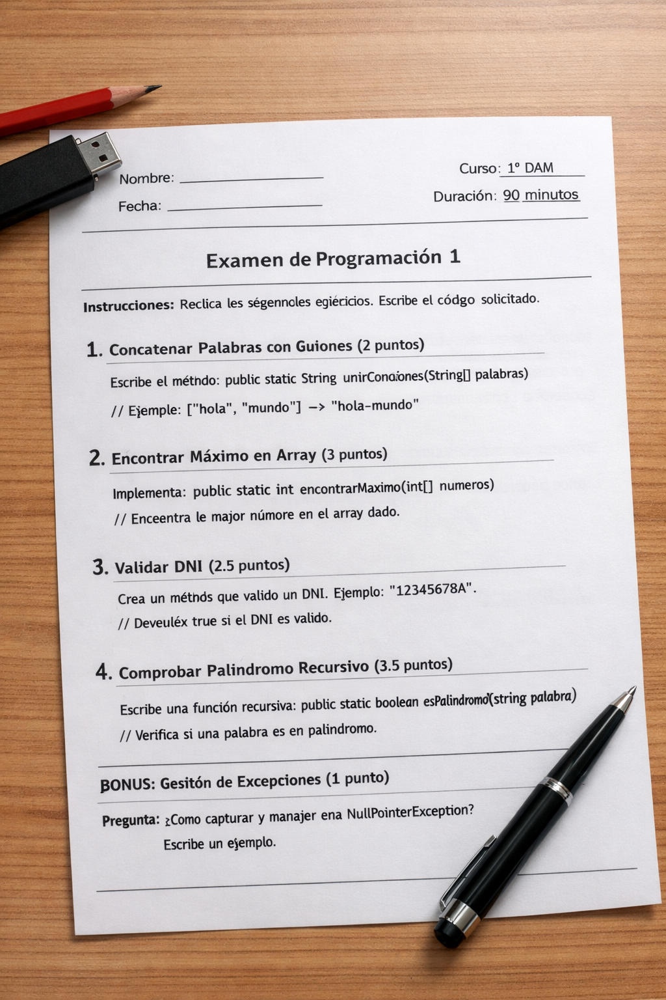

<div style="text-align: justify;">

# Tarea Calificable 3.1

<div style="text-align: center;">
  
</div>


Este proyecto contiene varios ejercicios organizados por tema y número:

- `src/main/java/com/docencia/<tema>/ejercicioN` → implementación del ejercicio
- `src/test/java/com/docencia/<tema>/ejercicioN` → tests JUnit (si están incluidos) para validar

Para ejecutar **todos los tests**:

```bash
mvn clean test
```

---

## Ejercicio 6 – Clases: Pedido (equals/hashCode/toString)

**Paquete:** `com.docencia.clases.ejercicio6`

### Objetivo

Completar la clase `Pedido` implementando constructores y los métodos básicos de objeto usando un identificador único.

### Enunciado

Implementar en `Pedido`:

- Constructor vacío `Pedido()` (dejar valores por defecto o inicializar si lo necesitas).
- Constructor `Pedido(String codigo)` que inicializa el identificador único.
- Resto de métodos que consideres necesarios y que el profesor que lo haya dicho desde incio del curso

### Tests de verificación

Ejecutar:

- `com.docencia.clases.ejercicio6.Ejercicio6Test`

Salida esperada: **todos los tests en verde**.

---

## Ejercicio 7 – Herencia: Personas y roles

**Paquete:** `com.docencia.herencia.ejercicio7`

### Objetivo

Completar la jerarquía `Persona` y sus subclases para devolver descripciones de rol y generar una lista de descripciones.

### Enunciado

- `Persona` es abstracta e incluye `String descripcionRol()`.
- `Estudiante` debe sobrescribir `descripcionRol()` devolviendo una descripción que incluya su curso.
- `Profesor` debe sobrescribir `descripcionRol()` devolviendo una descripción que incluya su especialidad.
- `Profesor.descripciones(List<Persona> personas)` debe devolver una lista de descripciones (en el mismo orden), **ignorando** elementos `null`.

### Tests de verificación

Ejecutar:

- `com.docencia.herencia.ejercicio7.Ejercicio7Test`

Salida esperada: **todos los tests en verde**.

---

## Ejercicio 9 – Arrays: concatenar con guion

**Paquete:** `com.docencia.arrays.ejercicio9`

### Objetivo

Implementar un método que concatene un array de palabras separándolas con `-`.

### Enunciado

`concatenarConGuion(String[] palabras)` devuelve un `String` uniendo con `'-'` usando un bucle `for`.
Si el array es `null` o está vacío, devuelve `""`.

**Ejemplos**

- Entrada: `["a","b","c"]` → Salida esperada: `"a-b-c"`
- Entrada: `[]` → Salida esperada: `""`
- Entrada: `null` → Salida esperada: `""`

### Tests de verificación

Ejecutar:

- `com.docencia.arrays.ejercicio9.Ejercicio9Test`

Salida esperada: **todos los tests en verde**.

---

## Ejercicio 10 – Composición: Gestor de proyectos y tareas

**Paquete:** `com.docencia.composicion.ejercicio10`

### Objetivo

Implementar la lógica de un gestor que crea proyectos, añade tareas y cuenta tareas pendientes.

### Enunciado

Clases involucradas: `Tarea`, `Proyecto`, `GestorProyectos`.

- `Proyecto crearProyecto(String nombre)`  
  Crea y añade un proyecto si el nombre es válido; si no, devuelve `null`.
- `boolean anadirTareaAProyecto(String nombreProyecto, String descripcionTarea)`  
  Añade una tarea si el proyecto existe (comparación **case-insensitive** + `trim`) y la descripción es válida.
- `int contarTareasPendientes(String nombreProyecto)`  
  Cuenta tareas no completadas; si el proyecto no existe, devuelve `0`.

### Tests de verificación

Ejecutar:

- `com.docencia.composicion.ejercicio10.Ejercicio10Test`

Salida esperada: **todos los tests en verde**.

---

## Ejercicio 15 – Listas: buscar primera cadena que contenga

**Paquete:** `com.docencia.listas.ejercicio15`

### Objetivo

Devolver el primer texto de una lista que contenga un fragmento dado.

### Enunciado

`buscarPrimeraQueContiene(List<String> textos, String fragmento)`:

- Devuelve el **primer** texto que contenga el fragmento.
- Comparación **case-insensitive**, aplicando `trim` tanto al texto como al fragmento.
- Si la lista es `null`, el fragmento es inválido o no hay coincidencias → devuelve `null`.

**Ejemplos**

- Textos: `[" Hola mundo ", "Adiós", null, " mUndo pequeño "]`, fragmento `"MUNDO"` → salida `"Hola mundo"`
- Textos: `["Hola","Adiós"]`, fragmento `"xxx"` → salida `null`

### Tests de verificación

Ejecutar:

- `com.docencia.listas.ejercicio15.Ejercicio15Test`

Salida esperada: **todos los tests en verde**.

---


</div>
